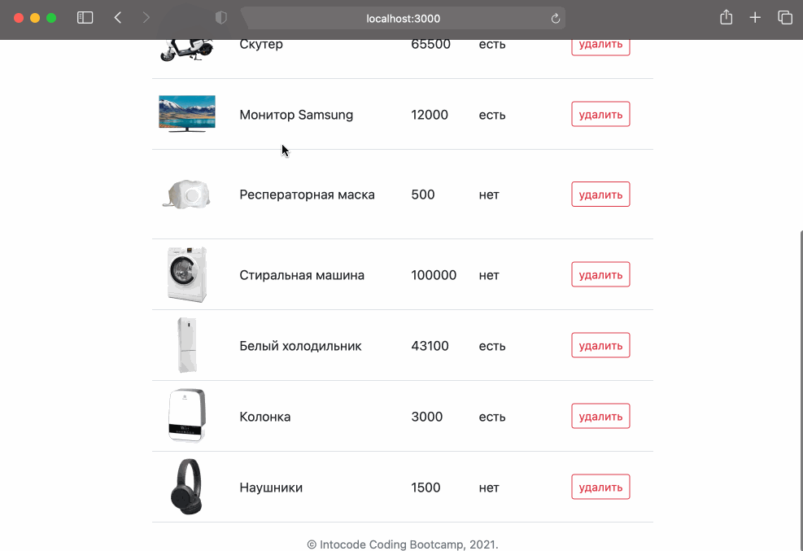

# Работа со стейтом: вывод и удаление

## Summary

В коде проекта есть массив с объектами, в которых представлен список товаров. Твоя задача сделать вывод этих данных в табличном виде, а также реализовать их удаление.

## Releases

### Pre release

Сделай форк и клон данного репозитория. Установи зависимости и приступай к релизам. Весь новый код нужно писать в компоненте `Products`. Другие файлы и компоненты изменять не следует.

### Release 0

Импортируй в файл `Products.js` данные из `fakeDatabase.js` и сделай для них табличный вывод как указано на превью выше. Выражение с `map` для вывода нужно встроить прямо в JSX-выражение, которое находится в `return`. Пример такого встраивания приведен [в документации React](https://ru.reactjs.org/docs/introducing-jsx.html#embedding-expressions-in-jsx).  

### Release 1

После того как вывод будет готов доработай кнопки удаления, чтобы они действительно удаляли указанный товар.

Не забудь о правильном именовании функции, которая обрабатывает событие.

### Release 2

Приведи код проекта в соответствие со знакомыми конвенциями. Примени к коду Prettier (он уже установлен в зависимости).

Исправь расширение файлов на `.jsx` там, где это необходимо.
